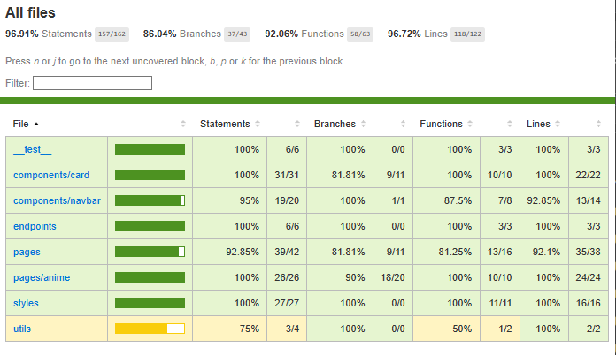

- App is developed by NextJS with the nature of SSR to have fast rendering and SEO benefit
- Anime list fetched from client side and have skeleton view for fast interaction and better UX while searching and changing pagination
- Anime detail page is server side rendered for instant rendering process


### Caching

SWR is used for data fetching so it can have caching capabilities for faster list navigation. Every call with the same endpoint URI will be cached, so when user go to pagination that already visited, data will be load instantly from cache instead of fetching to server within deduping interval (default 2000ms). Outside of the interval, data still be load from cache, and SWR will fetch again and revalidate the cache in the background. This also happen for searching anime because it have the same endpoint. SWR share caches to all SWR hook implemented from all separate components.

```ts
const { data: animes, isLoading } = useSWR<AnimesResponse>(
  `${GET_ANIMES}?limit=${LIST_LIMIT}&page=${pagination.page}&q=${query}`,
  {
    onSuccess(data) {
      setPagination({
        page: data.pagination.current_page,
        total: data.pagination.last_visible_page,
      });
    },
  }
);
```

### Authentication

Authentication with [next-auth](https://next-auth.js.org/) Google provider for convenience of passwordless login. Routes are protected from middleware level and redirection to have better Time to First Byte for accessing the site compared to client side session verification.

### Styling

[Emotion](https://emotion.sh/) used for styling to have SSR benefit and can be imported as modules. It support css nesting, media queries to have better responsiveness per element, and inject JS to style.

### Unit Testing

Unit testing using Jest and React Testing Library to test all components created that are not template from NextJS. The goal is to have minimum of 80% branch coverage for all file.


