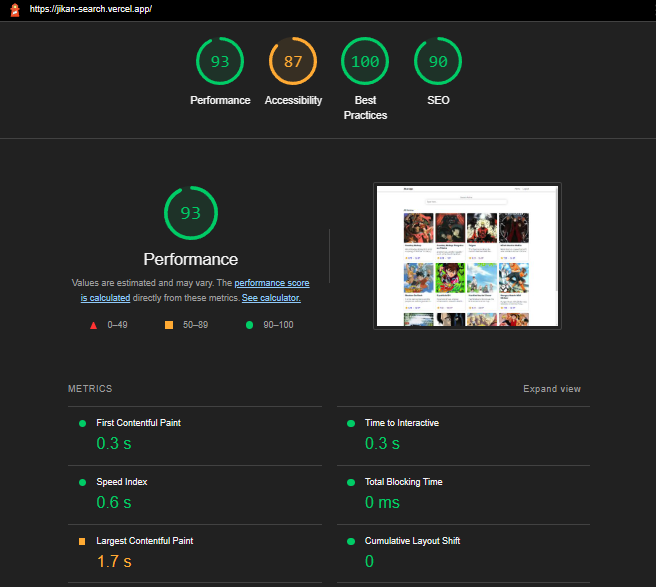
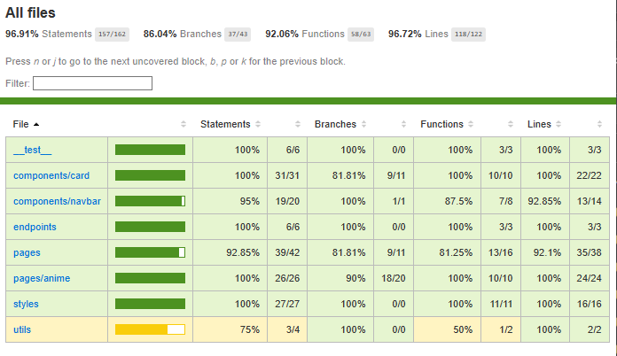

# Jikan App

This is anime list web app using [Jikan](https://docs.api.jikan.moe/) REST API

Features:

- Anime list page
  - Search
  - Pagination
- Anime detail page
  - details, synopsis, rating
  - stream link
  - related anime
- Google Authentication

## Preview

Live Site URL: [Preview](https://jikan-search.vercel.app/)

## Getting Started

First, install the dependencies:

```bash
npm install
# or
yarn install
```

add environment variables to `.env`

```
GOOGLE_CLIENT_ID=
GOOGLE_CLIENT_SECRET=
NEXTAUTH_SECRET=
```

run the development server

```bash
npm run dev
# or
yarn dev
```

Open [http://localhost:3000](http://localhost:3000) with your browser to see the result.

## Built with

- Typescript
- Framework: NextJs, React
- UI Library: Emotion, Geist UI
- Fetching Library: SWR
- Next Auth

## Lighthouse



## Coverage



## Author

- Website - [Fauzan Rianda](https://fauzanr.github.io)
- Linkedin - [Fauzan Rianda](https://www.linkedin.com/in/fauzanr/)
